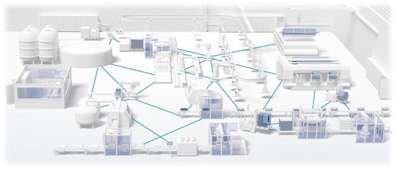

# 7. Gestion des données

La gestion des données est un pilier central de l'industrie du futur, englobant des technologies et des méthodes qui permettent de collecter, stocker, analyser et sécuriser une grande variété de données.

### Cloud Computing

Le cloud computing désigne l'utilisation de ressources informatiques (comme des serveurs, du stockage, des bases de données, des réseaux, des logiciels) disponibles sur demande via Internet. Les entreprises utilisent le cloud pour une flexibilité accrue, une meilleure gestion des coûts et pour faciliter l'accès aux données en tout lieu. Il permet aussi une collaboration efficace et une mise à l'échelle rapide des ressources informatiques selon les besoins.

### Big Data

Le Big Data fait référence à des ensembles de données si volumineux ou complexes qu'ils ne peuvent être traités efficacement par des applications de traitement de données traditionnelles. Le Big Data est caractérisé par les "3V" : volume énorme de données, variété de types de données (structurées, non structurées, semi-structurées), et la vélocité à laquelle ces données sont générées et traitées. L'analyse de Big Data permet de déceler des tendances, des corrélations et d'autres insights utiles pour la prise de décision.

### Data Science

La data science est un domaine interdisciplinaire qui utilise des méthodes scientifiques, des processus, des algorithmes et des systèmes pour extraire des connaissances et des insights de données structurées et non structurées. Elle implique diverses techniques issues de la statistique, de l'apprentissage automatique, de l'informatique et de la visualisation de données, pour analyser et interpréter des ensembles complexes de données.

### Cybersécurité

La cybersécurité concerne la protection des systèmes informatiques, des réseaux et des données contre les accès non autorisés, les attaques ou les dommages. Dans l'ère de l'industrie du futur, avec l'augmentation de la connectivité et de l'interdépendance des systèmes, la cybersécurité est devenue un enjeu crucial. Elle englobe diverses pratiques comme la cryptographie, la sécurité des réseaux, la sécurité des applications et la sensibilisation à la sécurité informatique.

### Blockchain

La blockchain est une technologie de stockage et de transmission d'informations, transparente, sécurisée, et fonctionnant sans organe central de contrôle. Par son design, une blockchain constitue un registre numérique dont les entrées sont regroupées en blocs, chaînés entre eux et sécurisés par cryptographie. Elle est particulièrement utile pour les transactions sécurisées, la traçabilité des actifs et la gestion des contrats intelligents, offrant une fiabilité et une transparence accrues dans les échanges d'informations.

Chacune de ces technologies joue un rôle essentiel dans l'optimisation et la sécurisation de la gestion des données dans l'industrie du futur, contribuant à une meilleure prise de décision, à l'efficacité opérationnelle et à l'innovation.