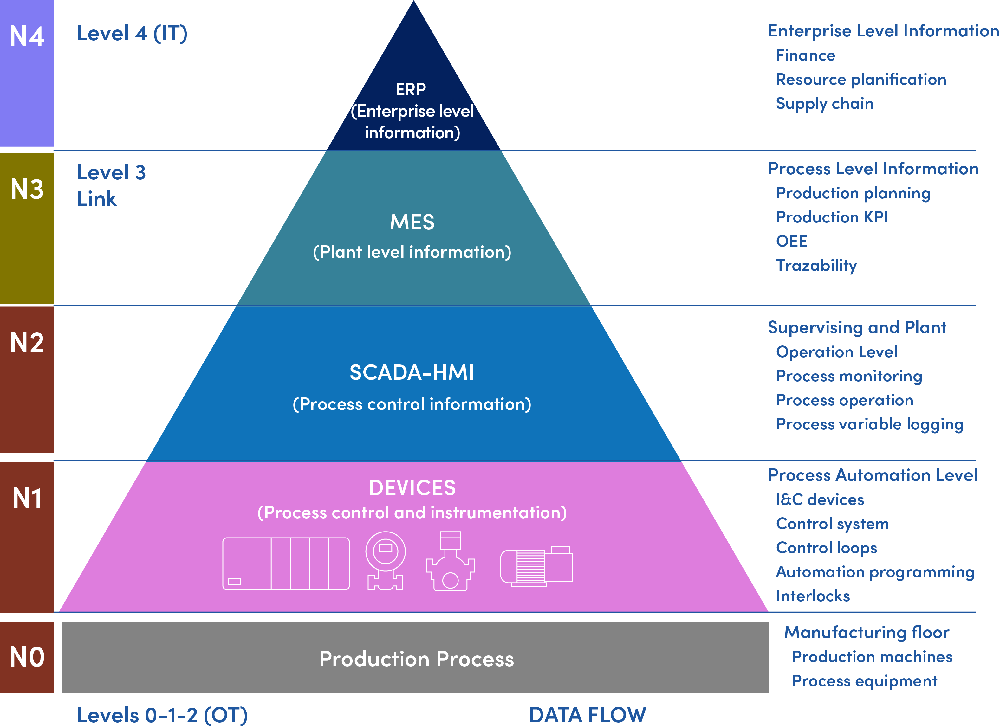

# Chapitre 3 : L'usine numérique

## Définition

Le thème d'usine numérique décrit une réorganisation du système de production basée sur l'usage du numérique.
Cette thématique regroupe tout les technologies du numérique appliquée à l'industrie de façon à adapter la façon dont nous produisons aux enjeux du futur.
L'usine numérique est un regroupement d'outils au service de la stratégie, de l'ingénierie et des consommateur.

## De l'archaïque au numérique

## La chaine numérique de l'entreprise

### DMU (Maquette numérique)

### PLM (Gestion du cycle de vie produit)
Constat : 
Divers système CAO ces données CAO ne sont pas bien exploité avec les autres application de l'entreprise (simu, gestion ...)

3DExperience PLM Collaboration service permet de tirer profit de ces données 

Chaque pièce CAO est lié à un élément d'ingénieurie (physical product)
Continuité digitale Manufacturing, simulation, Electrical ...

Accès à de nouveau mode de travail

Elément d'ingénieurie
Chaque pièce CAO est liée à un élément d'ingénieurue, un physical product.
Les fichiers CAO sont une représentation de la donnée.
Le format natif est conservé.

Chaque physical product correxpond à une pièce CAO.

2 Continuité digital.
CAO BOM ?
EBOM ?
MBOM ?
Production structure.

Continuité des version. ZERO PROBLEME DE VERSION ! Une version active de la pièce !

Privilégié les accès WEB.

Loi de moore ? Chap 1 ou 3

Faire la carte de l'usine numérique.

### Usine numérique

### ERP (Planification des ressources de l'entreprise)

## Usine virtuel

### i. Méthode et processus d'implantation

### Gain et perspective