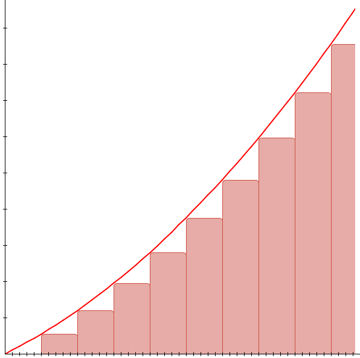
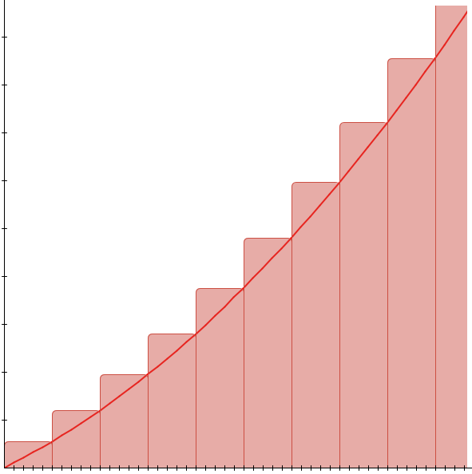
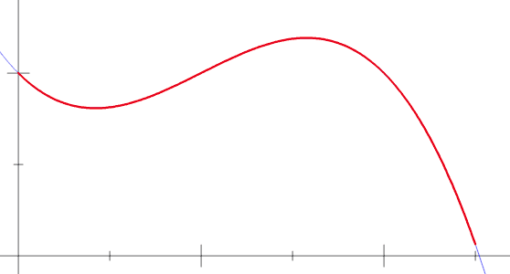

# Chapitre 4 : Introduction à l'analyse numérique

## Introduction

Les méthodes numériques jouent un rôle crucial dans divers domaines de la science, de l'ingénierie et de l'analyse de données. Elles permettent de résoudre des problèmes complexes qui sont souvent difficiles, voire impossibles, à résoudre analytiquement. Ces méthodes sont particulièrement utiles dans des domaines tels que la physique, la chimie, l'ingénierie mécanique et aéronautique, l'analyse financière et bien d'autres. L'objectif de ce cours est de fournir une compréhension solide des principes fondamentaux des méthodes numériques et de montrer comment elles peuvent être appliquées pour résoudre des problèmes réels.

Dans le monde réel, de nombreux systèmes ne peuvent pas être décrits par des formules simples ou des équations linéaires. Au lieu de cela, nous sommes souvent confrontés à des équations différentielles, des problèmes non linéaires, ou des systèmes dynamiques complexes qui nécessitent une approche plus sophistiquée pour leur analyse. Les méthodes numériques offrent un cadre pour approcher ces problèmes en les divisant en calculs plus simples, réalisables avec des ordinateurs.

Bien que les concepts de base des méthodes numériques puissent être compris et appliqués à la main pour des problèmes simples, l'usage d'outils informatiques est essentiel pour traiter des problèmes plus complexes. Des logiciels comme MATLAB, R, Python (avec des bibliothèques comme NumPy et SciPy), et même des langages plus bas niveau comme C++ ou Fortran, sont couramment utilisés dans ce domaine. Chaque outil et langage a ses propres avantages, et le choix dépend souvent du problème spécifique à résoudre, de la précision requise, et de la familiarité de l'utilisateur avec l'outil.

Dans ce chapitre nous aborderons les différentes méthodes numériques en commençant par l'intégration et la différenciation numérique, la résolution d'équations différentielles ordinaires, la méthode des différences finies, et enfin, la régression et l'ajustement de courbes. Chaque section comprendra des explications théoriques, des exemples pratiques, et des exercices pour renforcer la compréhension.

## Intégration et Différenciation Numérique
### Bases de l'Intégration Numérique

L'intégration numérique est une partie fondamentale des méthodes numériques. Elle est utilisée pour estimer la valeur des intégrales, en particulier lorsque la solution analytique est difficile ou impossible à obtenir. Cette section explore les techniques de base de l'intégration numérique.

#### Concept des Sommes de Riemann

La somme de Riemann est le point de départ pour comprendre l'intégration numérique. Elle est utilisée pour approximer l'intégrale d'une fonction sur un intervalle en divisant l'intervalle en petits segments.

- **Définition** : Pour une fonction \( f(x) \) continue sur l'intervalle \([a, b]\), la somme de Riemann est donnée par :

\[ S = \sum_{i=1}^{n} f(x_i^*) \cdot \Delta x \]
  
où \( \Delta x = \frac{b - a}{n} \) et \( x_i^* \) est un point dans le i-ème sous-intervalle \([x_{i-1}, x_i]\).

Il s'agit d'une approximation géométrique de l'intégrale de $f$ par la méthode des rectangles.

Notons que lorsque \(n \rightarrow + \infty \), c'est à dire lorsque le nombre d'interval est grand, on a : 

\[ \lim\limits_{n \rightarrow \infty} \frac{b - a}{n} \sum_{k=1}^{n} f(a + k \frac{b - a}{n}) = \int_{a}^{b} f(x) \,dx \]

|            Rectangles à gauche             |            Rectangles à droite            |
| :----------------------------------------: | :---------------------------------------: |
| {.img-medium} | {.img-medium} |

{.img-medium  style="display: block; margin: 0 auto"} 

#### Règle du Trapèze

La règle du trapèze est une méthode simple mais plus précise que la somme de Riemann pour calculer l'intégrale d'une fonction.

- **Formule** : L'intégrale de \( f(x) \) sur \([a, b]\) est approximée par :

\[\int_{a}^{b} f(x) dx = \frac{b-a}{n}\left(\frac{f(a) + f(b)}{2} + \sum_{k=1}^{n-1} f\left(a + k\frac{b-a}{n}\right)\right) + R_n(f)\]

\[ \int_{a}^{b} f(x) \, dx \approx \frac{\Delta x}{2} [f(a) + 2f(x_1) + 2f(x_2) + \ldots + 2f(x_{n-1}) + f(b)] \]

??? "Astuce"

	Regardez les coefficients qui se trouvent devant chaque terme à l'interieur des crochets. Pour la régle du Trapeze les coeficients se répetent comme décrit sur la liste ci-dessous.

	1. \[1 \Rightarrow 2 \Rightarrow 2 \Rightarrow ... \Rightarrow 2 \Rightarrow 2 \Rightarrow 1 \]

	

{.img-large style="display: block; margin: 0 auto"} 

#### Règle de Simpson

La règle de Simpson est une technique encore plus précise qui utilise des paraboles pour approcher l'intégrale.

- **Formule** : Pour \( n \) pair, l'intégrale de \( f(x) \) sur \([a, b]\) est approximée par :

\[ \int_{a}^{b} f(x) \, dx \approx \frac{\Delta x}{3} [f(a) + 4f(x_1) + 2f(x_2) + 4f(x_3) + \ldots + 4f(x_{n-1}) + f(b)] \]

#### Exemples et Exercices

1. **Calcul de l'aire sous une courbe** :
- Utiliser la règle du trapèze pour estimer l'aire sous la courbe de \( f(x) = x^2 \) entre 0 et 1.

- Comparer maintenant avec la solution analytique

2. **Application de la règle de Simpson** :
   - Estimer l'intégrale de la fonction \( \sin(x) \) sur l'intervalle \([0, \pi]\) en utilisant la règle de Simpson.

Ces méthodes offrent des degrés de précision différents et sont choisies en fonction des exigences de précision et de la complexité de la fonction à intégrer. La règle du trapèze est simple et efficace pour des fonctions relativement lisses, tandis que la règle de Simpson est plus appropriée pour des fonctions avec des variations plus importantes sur l'intervalle d'intégration.

#### Points Clés à Retenir

- La précision de ces méthodes dépend du nombre de sous-intervalles \( n \))(ou du pas de discrétisation \( \Delta x \)). Plus le nombre de sous-intervalles est élevé, plus l'approximation est précise.
- Cependant, une augmentation du nombre de sous-intervalles entraîne également une augmentation du temps de calcul. Il est donc crucial de trouver un équilibre entre précision et efficacité computationnelle.
- Ces méthodes sont fondamentales en analyse numérique et trouvent des applications dans de nombreux domaines, allant de la physique et de l'ingénierie à l'économie et aux sciences biologiques.

---

### Différenciation Numérique

La différentiation numérique est une technique utilisée pour approximer la dérivée d'une fonction à partir de valeurs discrètes. Cette méthode est particulièrement utile lorsque la dérivée exacte est difficile à calculer ou lorsque nous n'avons que des données expérimentales. 

Les méthodes des différences finies sont des formules utilisées pour estimer la dérivée d'une fonction en utilisant les valeurs de la fonction en des points spécifiques.

Pour rappel : la définition de la dérivée d'une fonction peut être données comme cela : 

\[f'(x) = \lim\limits_{h \rightarrow 0} \frac{f(x + h) - f(x - h)}{2h} \]

#### Différence Avancée (Forward Difference)

\[ f'(x) \approx \frac{f(x + h) - f(x)}{h} \]

Où \( h \) est un petit pas. Cette formule donne une approximation de la dérivée en utilisant le point actuel et le point suivant.

#### Différence Retardée (Backward Difference)

\[ f'(x) \approx \frac{f(x) - f(x - h)}{h} \]

Cette formule utilise le point actuel et le point précédent pour estimer la dérivée.

#### Différence Centrée (Central Difference)

\[ f'(x) \approx \frac{f(x + h) - f(x - h)}{2h} \]

Cette méthode, qui utilise le point avant et le point après, offre généralement une meilleure approximation que les différences avancées ou retardées. Elle neccessite néamoins d'avoir les points d'avant et d'après pour le calcul ce qui peut être difficile lors de la première itération d'un solveur ou aux abords des frontières.

#### Analyse des Erreurs

L'erreur dans la différentiation numérique dépend de la taille du pas \( h \) et de la nature de la fonction. En général, des valeurs plus petites de \( h \) conduisent à de meilleures approximations, mais peuvent augmenter l'erreur d'arrondi due aux limitations de précision des calculs informatiques.

#### Exemples et Exercices

1. **Estimation de la Dérivée** :
Calculer numériquement la dérivée de \( f(x) = x^2 \) en \( x = 2 \) en utilisant les trois méthodes de différences et comparer les résultats avec la dérivée analytique.

2. **Application en Physique** :
Utiliser la différentiation numérique pour estimer la vitesse et l'accélération à différents instants à partir de données expérimentales de position en fonction du temps.

#### Points Clés à Retenir

- La différentiation numérique est un outil puissant, mais elle peut être sensible aux erreurs d'arrondi, surtout pour des valeurs très petites de \( h \).
- Il est essentiel de trouver un équilibre entre la réduction de l'erreur de troncature (en choisissant un \( h \) petit) et la minimisation

 de l'erreur d'arrondi (en évitant un \( h \) trop petit).
- Dans la pratique, le choix de \( h \) peut dépendre de la nature de la fonction à différencier et du contexte de l'application.

Ces techniques de différentiation numérique sont fondamentales dans de nombreux domaines de l'ingénierie et de la science, en particulier lorsqu'il s'agit d'analyser des données expérimentales ou de résoudre des équations qui ne peuvent pas être traitées analytiquement.

Avec cette section, nous avons couvert les bases de l'intégration et de la différentiation numérique, deux piliers fondamentaux des méthodes numériques. Dans la prochaine partie du cours, nous aborderons les méthodes pour résoudre les équations différentielles ordinaires, en commençant par la méthode d'Euler, pour approcher les solutions d'équations différentielles ordinaire.

---

## Partie 2 : Résolution des Équations Différentielles Ordinaires (EDO)
### Méthode d'Euler

La méthode d'Euler est une des techniques numériques les plus fondamentales pour résoudre des équations différentielles ordinaires (EDO). Elle permet d'approximer la solution d'une EDO avec une condition initiale donnée.

#### Dérivation à partir de la série de Taylor

L'idée de base de la méthode d'Euler découle de la série de Taylor. Pour une fonction \(y(t)\) différentiable, la série de Taylor autour d'un point \(t\) est :

\[ y(t+h) = y(t) + h y'(t) + \frac{h^2}{2!} y''(t) + \cdots \]

Pour une approximation de premier ordre, on ignore les termes d'ordre supérieur à \(h\) :

\[ y(t+h) \approx y(t) + h y'(t) \]

Si \(y'(t) = f(t, y(t))\), une EDO, alors la méthode d'Euler peut être écrite comme :

\[ y_{n+1} = y_n + h f(t_n, y_n) \]

où \(h\) est le pas de temps, \(y_{n+1}\) est l'approximation de \(y\) au temps \(t_{n+1} = t_n + h\), et \(y_n\) est la valeur connue de \(y\) au temps \(t_n\).

### Implémentation et Exemples

**Implémentation** :
Pour implémenter la méthode d'Euler, on suit ces étapes :

1. Choisir un pas de temps \(h\) et un temps final \(t_{\text{fin}}\) pour la simulation.
2. Initialiser \(y_0\) à la condition initiale donnée.
3. Pour chaque pas de temps \(n\), calculer \(y_{n+1}\) en utilisant la formule précédente jusqu'à atteindre \(t_{\text{fin}}\).

**Exemple** :

Considérons une balle en chute libre sous l'effet de la gravité, mais contrairement à l'exemple précédent, intégrons l'effet des frottements de l'air. Les frottements de l'air sont souvent modélisés comme proportionnels à la vitesse de la balle, ce qui ajoute un terme de frottement à l'équation différentielle.

L'équation du mouvement, en prenant en compte la gravité et les frottements de l'air, peut être écrite comme :

\[ \frac{dv}{dt} = g - \alpha v \]

où :

- \(v(t)\) est la vitesse de la balle,
- \(g\) est l'accélération due à la gravité (\(9.81 \, m/s^2\) sur Terre),
- \(\alpha\) est le coefficient de frottement de l'air,
- \(t\) est le temps.

Le terme \(\alpha v\) modélise les frottements de l'air, avec \(\alpha\) représentant la force de frottement par unité de vitesse.

Pour intégrer l'équation différentielle qui décrit le mouvement d'une balle en chute libre avec frottements en utilisant la méthode d'Euler, nous suivons le schéma d'intégration suivant :

1. **Initialisation** : Définissez les conditions initiales du système : la position initiale \(x_0, y_0\), et la vitesse initiale \(v_{x0}, v_{y0}\). Choisissez également le pas de temps \(dt\) pour l'intégration.
On notera le vector \(\vec{x} = (x_0, y_0)\) et \( \vec{v} = (v_{y0}, v_{x0})\)

2. **Calcul de la Force de Frottement** : À chaque pas de temps, calculez la force de frottement agissant sur la balle. Si la force de frottement est proportionnelle à la vitesse, elle peut être exprimée comme \(F_{\text{frott}} = -\alpha v\), où \(\alpha\) est le coefficient de frottement.

3. **Mise à Jour de la Vitesse** : Utilisez l'équation différentielle pour calculer la vitesse de la balle au pas de temps suivant :

\[ \vec{v_{n+1}} = \vec{v_n} + (\vec{g} - \alpha \vec{v_n}) \cdot dt \]

Ici, \(g\) est l'accélération due à la gravité, et \(dt\) est le pas de temps.

4. **Mise à Jour de la Position** : Mettez à jour la position de la balle en utilisant la nouvelle vitesse :

\[ \vec{x_{n+1}} = \vec{x} +  \vec{v_n} \cdot dt \]

5. **Conditions aux Limites** : Si la balle atteint un bord de la zone de simulation (par exemple, le sol), ajustez sa vitesse et sa position en fonction des conditions physiques (comme un rebond).

Le schéma d'intégration complet donne alors

\[\begin{cases}
\vec{v_{n+1}} = \vec{v_n} + (\vec{g} - \alpha \vec{v_n}) \cdot dt\\
\vec{x_{n+1}} = \vec{x} +  \vec{v_n} \cdot dt
\end{cases}\]

!!! info
	Ce schéma est dit explicite car il est possible de calculer toutes ses composantes en fonctions des données déjà connu. Cependantil n'est pas très stable. Nous verons par la suite qu'en utilisant le schéma suivant, dit symplétique on reduit grandement l'erreur d'approximation avec un minimum d'effort.

	\[\begin{cases}
	\vec{v_{n+1}} = \vec{v_n} + (\vec{g} - \alpha \vec{v_n}) \cdot dt\\
	\vec{x_{n+1}} = \vec{x} +  \vec{v_{n+1}} \cdot dt
	\end{cases}\]

Ce schéma d'intégration simple permet d'approcher la trajectoire et la vitesse de la balle au cours du temps dans un contexte où les forces de frottement sont non négligeables. Il illustre bien l'utilisation de la méthode d'Euler pour résoudre des équations différentielles ordinaires (EDO) issues de problèmes physiques réels, en tenant compte de l'influence significative des frottements sur le mouvement.

	<button class="md-button" onclick="startpause()">Start simulation</button>
	<button class="md-button" onclick="resetSim()">Reset simulation</button>

	
	

<!-- 
#### Analyse des Erreurs et Stabilité

L'erreur dans cette simulation dépendra de la taille du pas de temps `dt` et du coefficient de frottement `alpha`. Un `dt` plus petit offre une meilleure précision mais nécessite plus d'itérations pour simuler la même durée en temps réel. La stabilité de la simulation est également influencée par la valeur de `alpha` : des valeurs très élevées peuvent nécessiter un ajustement de `dt` pour maintenir la précision et la stabilité de la simulation. 

#### Analyse des Erreurs et Stabilité

**Erreur** :
L'erreur dans la méthode d'Euler provient de l'ignorance des termes d'ordre supérieur dans la série de Taylor. L'erreur à chaque pas est proportionnelle à \(h^2\), mais l'erreur totale accumulée peut être proportionnelle à \(h\), rendant la méthode d'Euler de premier ordre.

**Stabilité** :
La stabilité de la méthode d'Euler dépend de la fonction \(f(t, y)\) et du choix de \(h\). Pour certaines EDO, un \(h\) trop grand peut rendre la solution numérique instable, particulièrement pour les EDO raides.

-->

---

- **Section 4 : Méthodes d'Ordre Supérieur**
  - Méthodes de Runge-Kutta.
  - Intégration de Verlet et Velocity Verlet.
  - Applications en physique et ingénierie.

{.img-tiny}

## Partie 3 : Méthode des Différences Finies (MDF)
- **Section 5 : Introduction à la MDF**
  - Discrétisation du domaine.
  - Application aux EDP : équation de la chaleur et équation des ondes.
  - Stabilité et convergence.

{.img-tiny}

## Partie 4 : Régression et Ajustement de Courbes
- **Section 6 : Régression des Moindres Carrés**
  - Théorie et dérivation.
  - Exemple de régression linéaire.
  - Applications et limitations.

{.img-tiny}

## Partie 5 : Exemples d'Application et Exercices
- **Section 7 : Applications Pratiques**
  - Exemples et exercices pour chaque méthode.
  - Scénarios réels et analyse de données.
  - Discussion sur le choix de la méthode appropriée.

{.img-tiny}

## Conclusion
- Résumé des concepts clés.
- Lectures complémentaires et sujets avancés.
- Remarques de clôture.
