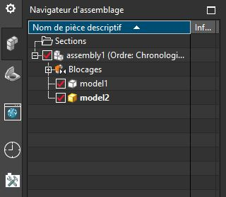
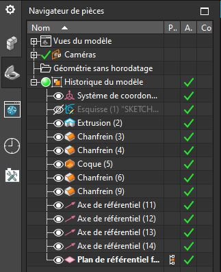
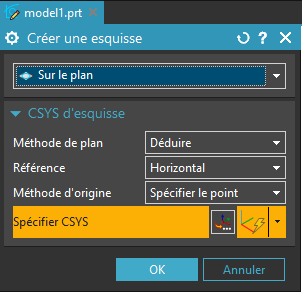

# Prise en main

Le logiciel Siemens NX est une application de conception mécatronique 3D
Paramétrique, qui permet aux concepteurs d'esquisser rapidement des idées, d'expérimenter des fonctions et des cotes afin de produire des modèles et des systèmes automatisés rapidement.
Cette section explique les concepts et la terminologie de l'application et a pour but de vous familiariser avec les fonctionnalités les plus utilisées de SolidWorks.

## Configuration système
Configuration recommandée pour NX 11 : 

- Windows 7 ou 10 64bits
- 4 GB RAM minimum, 8 GB ou 16 GB RAM recommandé
- True Color (32-bit) ou 16 million de couleur (24-bit)
- Résolution: 1280 x 1024 ou plus, format paysage

## Concepts
Le logiciel est basé sur la conception de modèles 3D en s'appuyant sur les autres logiciels Siemens comme TIA ou PLCSIM.

Les pièces constituent les éléments de base du logiciel NX. Les assemblages contiennent des pièces ou d'autres assemblages, appelés des sous-assemblages.
Un modèle NX est constitué de géométrie 3D qui définit ses arêtes, faces et surfaces. Le modèle numérique des pièces peut également être utilisé pour simuler des comportements mécaniques ou pour préparer un îlot de production automatisé.

Avec NX vous pouvez aussi bien :

- concevoir puis fabriquer une pièce ou un système
- simuler un îlot de production automatisé
- créer un jumeau numérique connecté à un automate réel ou virtuel (PLCSIM)

### Modélisation 3D
La modélisation 3D est aujourd'hui une étape fondamentale dans la création d'un produit. Lorsque vous concevez un produit, vous modélisez les pièces de l'esquisse 2D jusqu'au résultat numérique final. À partir de ce modèle, vous pouvez réaliser des documentations techniques à l'aide de mise en plan ou encore générer les programmes de fabrication. A l'aide des fonctions d'assemblage, vous pouvez créer des documentations d'assemblage ou de fabrications ou encore simuler les interactions entre vos composants.

Les modèles 3D réaliser à partir de NX peuvent être visualisé en 3D pendant la conception. Vous pouvez également générer des rendus réaliste avant même que le produit ne soit prototypé.

<figure>
  
  <figcaption>Pièce 3D sous NX</figcaption>
</figure>

<figure>
  
  <figcaption>Assemblage sous NX</figcaption>
</figure>

<figure>
  
  <figcaption>Mise en plan réalisé sous NX</figcaption>
</figure>

## Terminologie

| Termes               | Définition                                                                                                                                                                                                                                                                                                                                     |
| -------------------- | ---------------------------------------------------------------------------------------------------------------------------------------------------------------------------------------------------------------------------------------------------------------------------------------------------------------------------------------------- |
| __Pièce de travail__ | Sous NX la pièce de travail et la pièce en cours de modification. Si on travaille dans un assemblage de plusieurs pièces, il convient de définir préalablement une pièce comme pièce de travail avant de pouvoir la modifier. Il ne peut y avoir qu'une pièce de travail sélectionnée à la fois.                                               |
| __Origine__          | Sous NX Le système de coordonnées représente le point (0,0,0) de la pièce de travail actuelle. Souvent représenté en marron clair le repère est composé de 3 axes (X,Y,Z) et 3 plan (XY, YZ, XZ). Parfois le repère peut être représenté par trois vecteur colorés (X en rouge, Y en vert, Z en bleu). Sous NX l'axe Z est vertical par défaut |
| __Plan__             | Géométrie de construction plate. Vous pouvez utiliser des plans pour ajouter une esquisse 2D, une vue en coupe d'un modèle ou un plan neutre dans une fonction de dépouille, par exemple.                                                                                                                                                      |
| __Axe__              | Ligne droite utilisée pour créer une géométrie de modèle, des fonctions ou des répétitions. Vous pouvez créer un axe de différentes manières, par exemple en utilisant l'intersection de deux plans. L'application SOLIDWORKS crée implicitement des axes temporaires pour chaque face conique ou cylindrique d'un modèle.                     |
| __Face__             | Contours qui permettent de définir la forme d'un modèle ou d'une surface. Une face est une zone sélectionnable (plane ou non) d'un modèle ou d'une surface. Par exemple, un parallélépipède rectangle a six faces.                                                                                                                             |
| __Arrête__           | Emplacement où deux faces ou plus se croisent et sont jointes. Vous pouvez sélectionner des arêtes à des fins d'esquisse et de cotation, par exemple.                                                                                                                                                                                          |
| __Sommet__           | Point où se croisent deux ou plusieurs lignes ou arêtes. Vous pouvez sélectionner des sommets à des fins d'esquisse et de cotation, par exemple.                                                                                                                                                                                               |

## Interface utilisateur
L'interface de NX est très rapide à prendre en main notamment grâce à ses grandes icône et à la fonction recherche permettant de trouver rapidement les fonctionnalités cachée.

<figure>
  
  <figcaption>Interface d'accueil</figcaption>
</figure>

Sous NX l'interface se présente toujours de la même manière. Même si le thème peut être changé, la disposition des éléments ne change pas significativement. Tout en haut de la fenêtre, à côté du logo, vous trouverez la barre d'action rapide.

### Barre d'actions rapide
<figure>
  
</figure>

Elle comporte les boutons : nouveau fichier, enregistrer, les actions récentes ainsi que les boutons épinglés. En effet, si vous épinglez des fonctions à l'accès rapide, ils s'ajouteront dans cette barre.

### Fonctions de conception
Juste au-dessous, vous trouverez des onglets dans lesquelles se trouve les fonctions disponibles. Ces onglets sont mis à jour en fonction du type de pièce que vous éditez.

<figure>
  
</figure>

S'il s'agit de la modélisation d'un pièce seul, vous trouverez les onglets relatifs à la modélisation (Esquisse, extrusion ...) : 

<figure>
  
</figure>

### Volet de navigation
Sur le volet latéral gauche, vous trouverez plusieurs onglets parmi lesquels : la documentation NX, le navigateur de pièces, le navigateur d'assemblage, les fichiers récents...
Ici encore ces menus s'adaptent à votre environnement de conception. (Le navigateur d'assemblage ne s'affichera que dans un assemblage.)

{align=left}

 

#### Navigateur d'assemblage

C'est dans ce volet que vous pourrez naviguer entre vos différentes pièces et assemblages. L'arbre de l'assemblage permet de naviguer entre les composants de l'assemblage, de sélectionner les liaisons mécaniques ainsi que les éléments de construction géométrique.

 
 
 

{align=left}

 

#### Navigateur de pièce

Lorsque vous éditez une pièce, vous pouvez aussi accéder au navigateur de pièce. Dans celui-ci, se trouve l'historique de toutes les opérations 3D apporté à une pièce. Ces opérations sont triées de haut en bas par ordre chronologique. Chaque modification dans une des opérations impactera les opérations situées sous celle-ci. Les opérations hautes, dessus, ne seront pas affectées.

 
 
 
 

### Menu contextuel des opérations

{align=left}

 

Après avoir cliqué sur une opération (nouvelle esquisse, extrusion, ou n'importe quelle fonction de la barre d'outils), NX ouvrira le menu contextuel de la fonction. Dans ce menu, vous devrez souvent spécifier les objets de référence de la fonction, les paramètres, les cotations... La même fenêtre s'ouvrira à chaque fois que vous modifierez une fonction dans le [navigateur de pièce](#navigateur-de-piece)

 

## Processus de conception

Le processus de conception passe par les étapes suivantes :

- Identification des spécifications du modèle
- Conceptualisation du modèle sur la base des besoins identifiés
- Développement du modèle sur la base des concepts élaborés
- Analyse du modèle
- Prototypage du modèle
- Construction du modèle
- Édition du modèle si nécessaire

En conception, il est important de bien définir sa stratégie de modélisation avant de modéliser.
En effet, il est parfois laborieux de revenir en arrière pendant la conception. L'idéal est donc de prévoir à l'avance la stratégie globale de modélisation.
Toutefois, il est indispensable de pouvoir revenir en arrière occasionnellement. Il existe quelque méthode afin de s'assurer un peu de flexibilité.

Il est fondamental d'analyser et de comprendre le besoin auquel la conception répond, mais également d'anticiper les exigences futures pour limiter les efforts de reconception.

Avant de procéder réellement à la conception du modèle, il est utile de planifier sa méthode de création.
Une fois les besoins identifiés et les concepts appropriés élaborés, vous pouvez développer le modèle :

|             |                                                                                                                                                             |
| ----------- | ----------------------------------------------------------------------------------------------------------------------------------------------------------- |
| Esquisses   | Créez les esquisses et décidez du mode de cotation et des emplacements d'application des relations.                                                         |
| Fonctions   | Sélectionnez les fonctions appropriées, comme les extrusions et les congés, déterminez les meilleures fonctions à appliquer et l'ordre de leur application. |
| Assemblages | Sélectionnez les composants à contraindre et les types de contraintes à appliquer.                                                                          |

!!! note
    Un modèle contient presque systématiquement une esquisse et une fonction au moins. En revanche, les modèles ne comprennent pas tous des assemblages

## Préférences utilisateur

