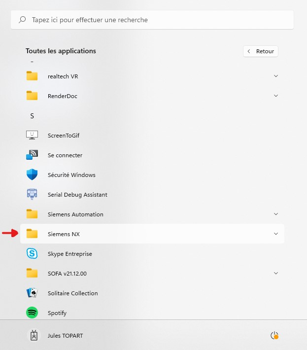
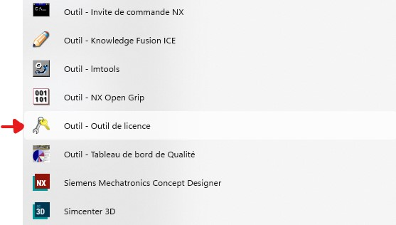
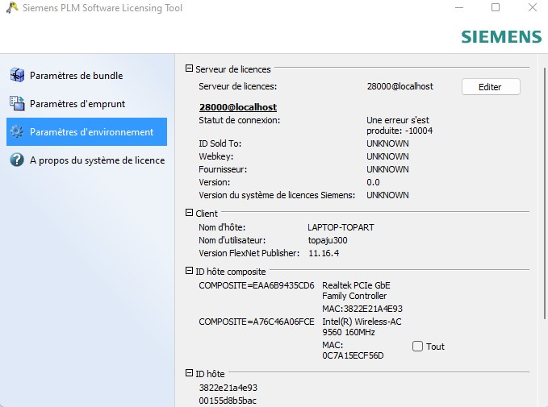
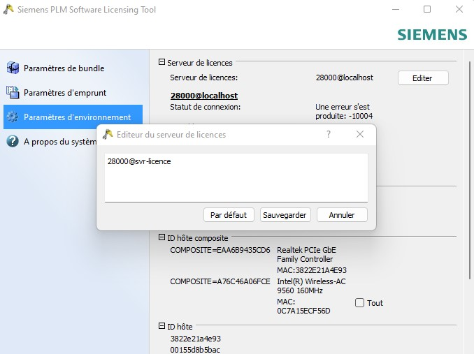
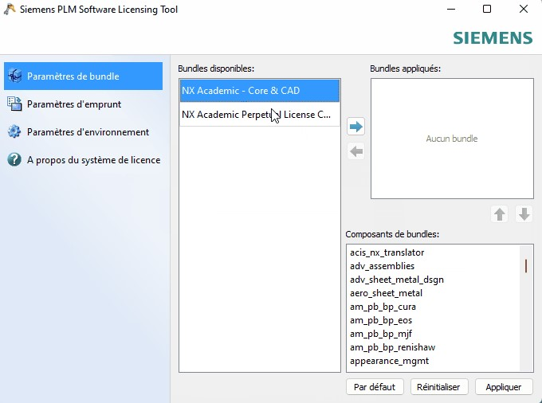
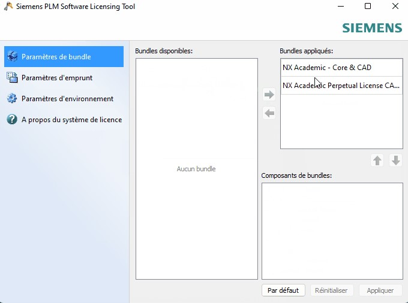

# Problème de licence NX

Si vous rencontrez un problème de licence avec Siemens NX, suivez la procédure ci dessous :

1. Commencer par fermer toutes les instances de NX.
2. Ensuite, dans les applications Windows, recherchez le dossier __Siemens NX__.

    

3. Dans ce dossier, ouvrez l'outil de licence.

    

4. Dans l'outil de licence, rendez vous dans les paramètre d'environement.
    
    

5. Remplacer l'adresse par `28000@svr-licence`

    

6. Rendez vous ensuite dans l'onglet Bundle.

    

7. Vous selectionnerez les 2 bundle pour les passer de gauche à droite.

    

Valider puis relancer NX. Si le problème de licence persiste, contacter votre administrateur ou votre enseignant.