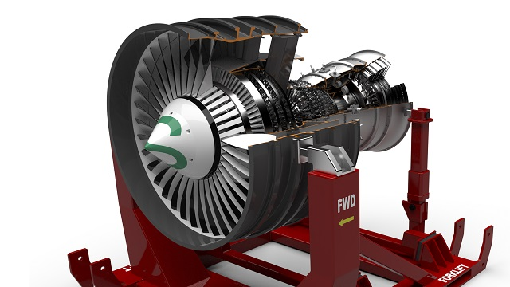
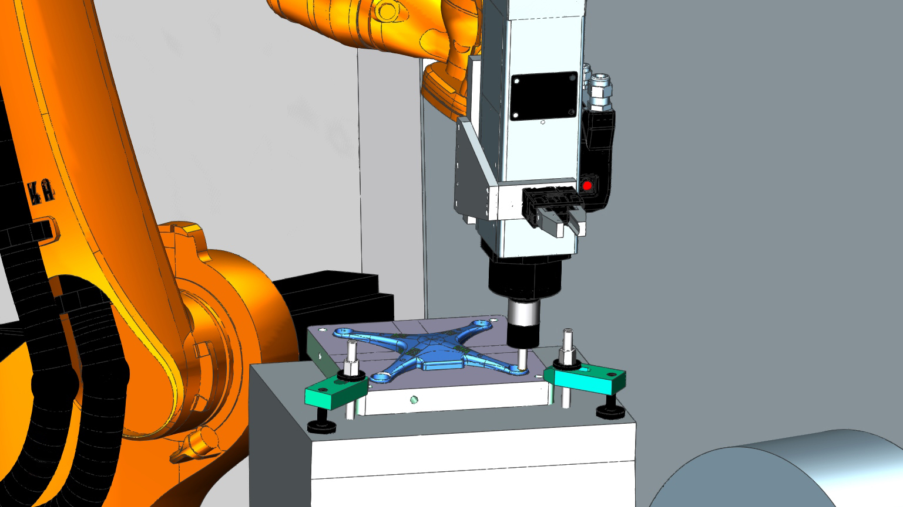

# Introduction

<figure>
    
</figure>

Ce site met à votre disposition une série de tutoriels vous permettant d'appréhender NX. N'hésitez pas à l'utiliser pendant les travaux pratiques ou les projets.

!!! quote "Description"
    Le logiciel NX de Siemens est une solution intégrée flexible et puissante, qui vous aide à proposer de meilleurs produits de façon plus rapide et plus efficiente. NX incarne la nouvelle génération de solutions de conception, de simulation et de fabrication, qui permettent aux entreprises de profiter des avantages du « jumeau numérique ».

    Prenant en charge tous les aspects du développement de produits, de la conception à l’ingénierie et à la fabrication, NX vous offre un ensemble d’outils intégrés qui coordonne les disciplines, préserve l’intégrité des données et l’intention de conception, tout en rationalisant l’ensemble du processus.

[Prise en main](getting-started.md){ .md-button .md-button--primary}

## NX for design

!!! quote "NX Design"
    NX for Design – la solution de développement de produits la plus puissante, flexible et innovante du marché – offre les fonctionnalités et les performances nécessaires pour vous aider à mettre vos produits sur le marché plus vite que jamais.

[Modéliser sous NX](nx-design.md){ .md-button .md-button--primary}

## NX for Manufacturing

!!! quote "NX Manufacturing"
    Transformez numériquement la fabrication de pièces à l’aide d’un système logiciel intégré unique qui permet de programmer les machines-outils CN, de contrôler les cellules robotiques, de piloter les imprimantes 3D et de contrôler la qualité du produit.

[Produire avec NX](nx-manufacture.md){ .md-button .md-button--primary}

